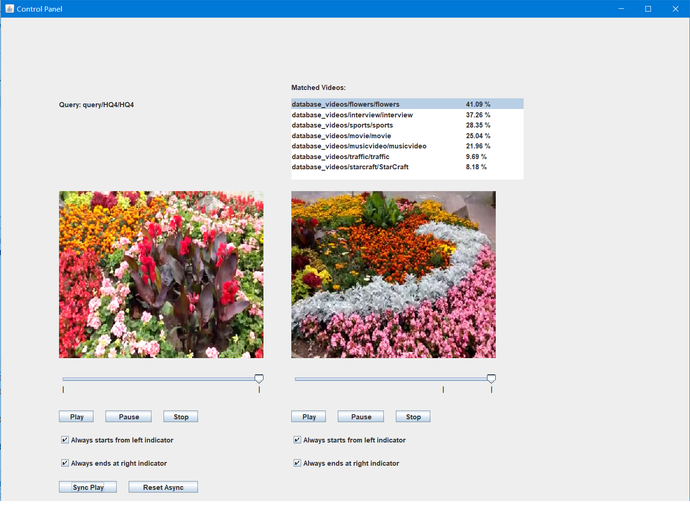

# Read me

A video query application based on Java and OpenCV.

First, the application analyzes all videos in database and extract useful features. 

Then, it extract these features from a new video clip and compare them with existed features generated by videos in the database. Therefore, it can find out the best matching, including in which video and during which period.

Generally, we have two main features to extract. They are audio fingerprint and HSV histogram.

Here is the running screenshot:

